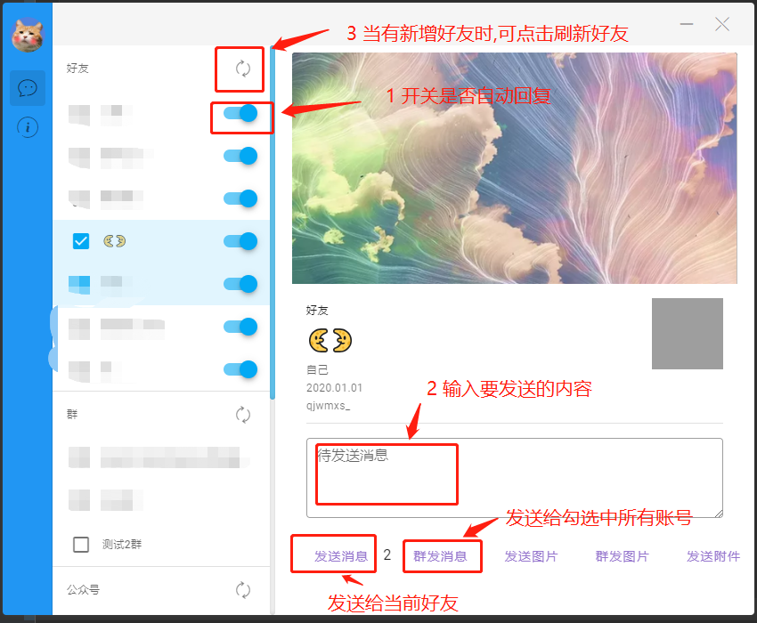

## 警告

<b>本项目初衷为解决生活中需要被动回复消息/发送文件,严禁用于打广告/推广等行为</b>

## 需要到的工具

微信: [2.9.0.123](https://pan.baidu.com/share/init?surl=zRJzwlZ1r8aRBeEc0lg1sw)

提取码：j4m0

微信助手: [0.1.20](https://pan.baidu.com/s/1-bjFgPO2vGMTh6uj9411Gg)

提取码：vir6

## 回复方式

公众号(使用的微软小冰)


[图灵机器人](http://www.turingapi.com/)

不过机器人都很傻,不要抱有太大希望

## 使用方法

1 在登录微信后


也就是这个页面,打开`微信助手.exe`<b>请勿在微信登录界面打开微信助手工具,否则微信助手工具将无法正常使用</b>

2 通过设置 `我的电脑 -> 文档 -> wechat-tool -> config.yaml`来配置微信助手

配置说明

```
# 文档\wechat-tool\config.yaml
name: []
# 回复方式 gh为微信公众号方式回复 需先关注 苏某人的日常 truing为图灵机器人的方式回复,需先申请图灵机器人
replyType: "gh", // gh truing
# 机器人名称 群交流格式为 `@机器人昵称 要说的话`||`机器人名称 要说的话`为空时且不@群消息不做回复,好友交流格式为`要说的话`
turingApiKey: xxxxxxxx
# turingApiKey: 图灵apiKey 为空时不启用图灵机器人
open: []
#  - 呼叫小熊
# open: 唤起机器人快捷语 为空时默认关闭
close: []
# - 撤退!小熊
# close: 关闭机器人快捷语 为空时不可关闭机器人
custom:
  - text: '小熊,发送配置文件'
    type: "file"
    exact: false
    content: 'C:\config.yaml'
  - text: '小熊,发送图片'
    type: "image"
    exact: false
    content: 'C:\1.jpg'
  - text: '小熊,发送图片文件'
    type: "file"
    content: 'C:\1.jpg'
    exact: true
  - text: '你好'
    type: "text"
    content: '你好呀!'
    exact: true
# 当回复关键字发送快捷语(无需开启好友消息自动回复)
# text: 接受到的关键字
# type: 发送类型 分为 image(图片), file(不大于100M的文件), text(自定义文本)
# content: 发送的快捷语
# exact: 是否精确匹配快捷语
# chart: 群消息是否使用快捷语
userOpen: 2
# userOpen: 聊天是否使用机器人(仅限好友) 0 不使用 1 使用快捷语唤起 2 静默唤起
```
目前hook获取微信群好友昵称有问题,所以暂时不支持`@xxx`

3 配置完成后,重启微信助手

4 微信助手功能



此处还有一个隐藏的彩蛋,欢迎各位发现并使用,在这里不做说明

5 下面讲讲配置文件中关于自定义回复的说明

当你需要被动回复关键字的时候,你在`custom`字段下设置`text`为接受到的关键字,`type`设置为`text`,`content`为你要回复的话,`exact`为是否匹配关键字

如当我接受到好友发来的<b>包含</b>`你好`时,自动回复`你好呀!`,设置如下

```
custom:
  - text: '你好'
    type: "text"
    content: '你好呀!'
    exact: true
```

如当我接受到好友发来的`你好,朋友`时,自动回复`你好呀!`,设置如下

```
custom:
  - text: '你好,朋友'
    type: "text"
    content: '你好呀!'
    exact: false
```
`exact`设置为`false`时,当好友发来`你好,朋友xxx`,不做回复,当`exact`为`true`时,当好友发来`你好,苏`,将自动回复`你好呀!`
需要设置多关键字回复时
```
custom:
  - text: '你好,朋友'
    type: "text"
    content: '你好呀!'
    exact: false
  - text: '你是谁'
    type: "text"
    content: '苏某人'
    exact: true
```

当需要回复文件时,将`type`设置为`file`,`content`设置为文件路径,如
```
custom:
  - text: '你好,朋友'
    type: "file"
    content: 'c:/1.txt'
    exact: false
```

当需要回复图片时,将`type`设置为`image`,`content`设置为图片路径,如
```
custom:
  - text: '你好,朋友'
    type: "image"
    content: 'c:/1.png'
    exact: false
```

当群消息不需要被回复时,将`chart`设置为`false`,则仅回复好友消息,如
```
custom:
  - text: '你好,朋友'
    type: "image"
    content: 'c:/1.png'
    exact: false
    chart: false
```
在这种情况下,当接收到`你好,朋友`时,如果对方是好友,则进行回复,如果是群则不进行回复
